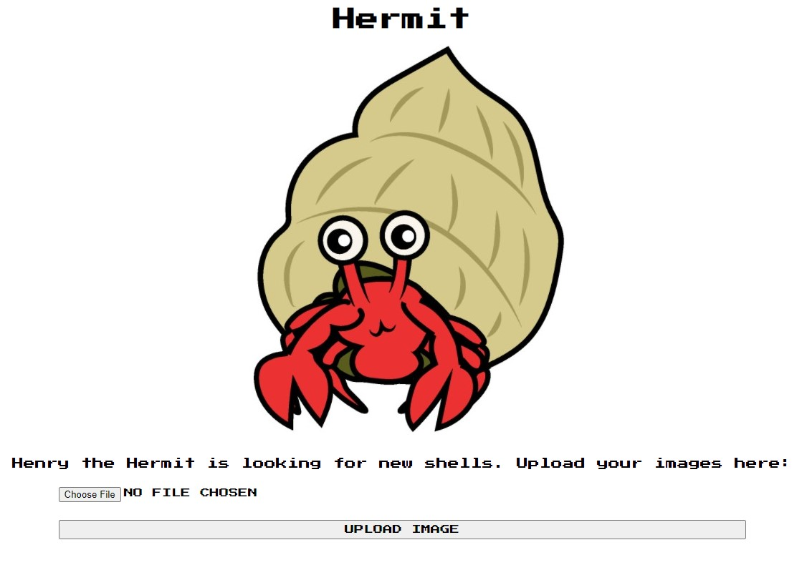
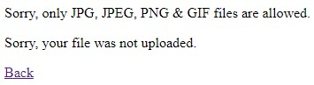
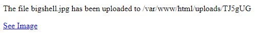
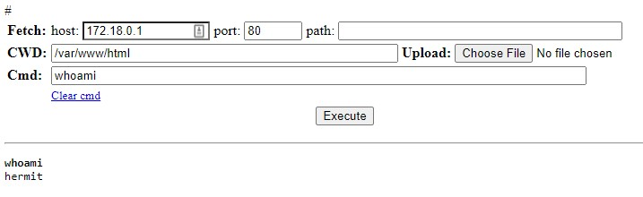
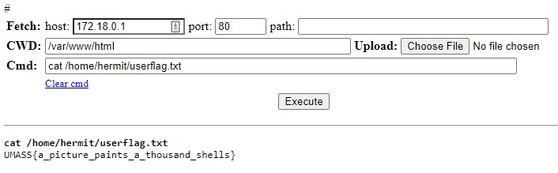
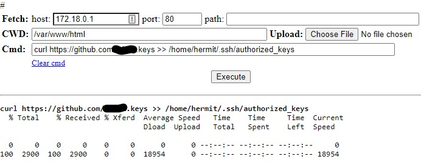
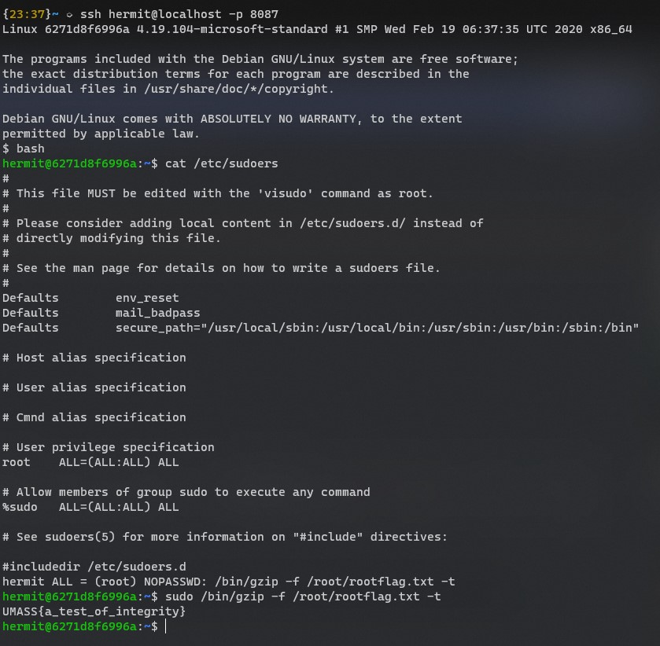

# Hermit <!-- omit in toc -->

- [[1] Walkthrough](#1-walkthrough)
  - [[1.1] Initial Recon](#11-initial-recon)
  - [[1.2] Gaining Access and Retrieving the User Flag](#12-gaining-access-and-retrieving-the-user-flag)
  - [[1.3] Privilege Escalation and Retrieving the Root Flag](#13-privilege-escalation-and-retrieving-the-root-flag)

# [1] Walkthrough

## [1.1] Initial Recon 

First we navigate to `localhost:8086` and are met with a home page containing an upload form that prompts for an image upload. If try to upload a few different files, we'll notice the app seems to generate random filenames for things we upload and will provide a redirect link to `/show.php?filename=<fp>` where `fp` is some random string it generates. The app will also error and not accept our upload unless what we upload is a `.jpg`, `.png`, `.jpeg` or `.gif`. If we try uploading a `.php` file for example we receive this error.

<details>
<summary>Screenshot</summary>




</details>

## [1.2] Gaining Access and Retrieving the User Flag

Despite the app seemingly only allowing images, we don't know if it's actually checking the uploaded file mime types or whether it's just looking at file extensions. If we put together a simple php webshell like so:

```php
<?php echo shell_exec($_POST['cmd']);
```
and name it something like shell.jpg then upload, success! It works and we now have a webshell on the target. If we execute a whoami command we can see are currently operating under the context of the `hermit` user. If we then search that user's home directory we find the initial `userflag.txt` file. A simple `cat` operation executed via our webshell allows us to retrieve that.


<details>
<summary>Screenshot</summary>





</details>

## [1.3] Privilege Escalation and Retrieving the Root Flag

Now, if we snoop around the `hermit` user's home directory a little more we can see they appear to have a `.ssh` directory. Let's assume ssh is enabled on this server and, via our webshell, curl our own ssh keys into the `authorized_keys` file for the `hermit` user.

Sure enough, we are able to sign in over ssh as the `hermit` user.

<details>
<summary>Screenshots</summary>



</details>

Once logged in with an interactive shell, if we dig around a bit we'll find it appears we have read access to `/etc/sudoers`. If we `cat` this file out we find something interesting. Our user appears to have password-less `sudo` access to the `gzip` command specifically on a file named `/root/rootflag.txt`

If we run the command `sudo /bin/gzip -f /root/rootflag.txt -t` we retrieve our root flag!

<details>
<summary>Screenshots</summary>



</details>